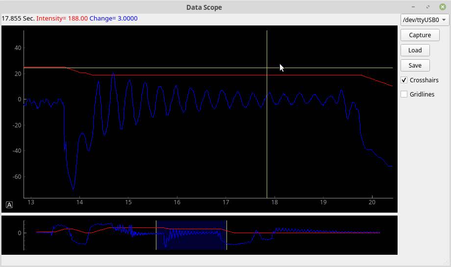

# Datascope Data viewer

[](https://www.gnu.org/licenses/gpl-3.0)



## Why?
I tried a number of available packages to plot data coming from my embedded project. But the ones I tried required very specific data formats, 
and my project couldn't support them as the project was tight on processor time. My project really needed to spit out binary formatted
data. 

I also found that I was unable to build or run several of the programs I tried.

I wrote a similar logging program at work last year, using Python and MatPlotLib. It worked, and was very useful, but I always wanted it 
to show the data live - as I was capturing it. Datascope will do this, and then after the capture is completed, I can zoom into the data
and see details about it, just like I could on an analog oscilloscope.

### What it does

The Datascope captures data from the serial port and displays the output live. The view compresses over time, so you always see all of the data while capturing.
Pressing the capture button a second time stops the capture, at which time you can zoom in on the data, and use the cross-hairs to see the exact values 
and timing information.

A configuration file is used to set the basic data format you will be using. If you have special requirements, or do not have control over the serial port formatting, 
new code must be written to deal with that. You can use the existing code as a basis.

After configuring, the program can be run, and the serial port can be selected. Then simply press "Capture".

## Current state of the project

These basic features don't yet work

 - "Load" and "Save" buttons do not work
 - Gridlines feature has not been implemented
 - Binary capture has not been implemented (but is well in progress - I just don't need it at the moment)
 
I want to add the following features:

 - After a capture, clicking on the main window will mark a spot, after which the crosshairs will measure relative to the mark. Right clicking removes the mark.
 - Add export feature - export to a spreadsheet (using CSV?)
   
## Prerequisites

I am currently building this on Linux Mint -  but the program should run on any modern OS, where the steps will be similar.

 - Install python 3 (I'm using Python 3.6)

 - Use your package manager to install pip for python 3

```bash
sudo apt install python3-pip
```

 - Install QT 5 [https://www.qt.io/download](https://www.qt.io/download)   Warning! - this takes several minutes and uses several gigabytes of disk space...

Finally, install these python modules:

```bash
sudo pip3 install numpy pyserial pyqtgraph pyqt5
```

Additionally, you might need these for QT:

```bash
sudo apt-get install libfontconfig1 mesa-common-dev libglu1-mesa-dev -y
```

## To run the program

You will need to copy the the default config file to one that the program can use. Take a look, a number of things are configurable.
 
```bash
cp plotter/config_default.py plotter/config.py
```

As you will likely need to change the program to work with the particular embedded device's output data format, I suggest you run it from an IDE.
- Eclipse CDT + PyDev (Recommended)
- PyCharm
- Spyder

Otherwise, run it like this (modify to match your installation):

```bash
export PYTHONPATH=/usr/lib/python3/dist-packages:/usr/local/lib/python3.6/dist-packages:/usr/lib/python3.6/lib-dynload:/usr/lib/python3.6
cd Datascope/plotter
python3 live_data.py
```

## Contribute

Please create a page on the wiki and propose your idea!

## License

The software is released under the GNU General Public License version 3.0
